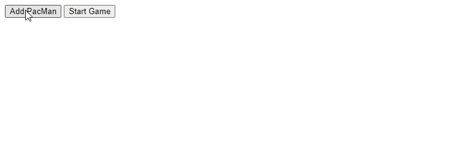

# PacMen Exercise 🕹️

## Description

In this project, there are two button options, **Add PacMan** and **Start Game**.  Every click of the **Add PacMan** button will add a PacMan character to the window.  Clicking the **Start Game** button will start moving the PacMan characters that were previously added.  When the characters hit the edge of the window on the x-axis, they will change the direction they are moving and face the opposite direction.

## Preview

\* *Demonstration illustrates moving objects across the DOM*

## How to Run 

1. Fork a copy of this project to your [GitHub](https://github.com) repository
2. Clone a copy from your [GitHub](https://github.com) repository to your local machine
3. Open the index file in your web browser

## Roadmap of Future Improvements

- [ ] Add background image

## Tech Stack

| Front End    |
| ------------ |
| JavaScript   |

## License Information

[MIT License](https://choosealicense.com/licenses/mit/)

Copyright (c) 2021 [bryanjob](https://github.com/bryanjob)

Permission is hereby granted, free of charge, to any person obtaining a copy
of this software and associated documentation files (the "Software"), to deal
in the Software without restriction, including without limitation the rights
to use, copy, modify, merge, publish, distribute, sublicense, and/or sell
copies of the Software, and to permit persons to whom the Software is
furnished to do so, subject to the following conditions:

The above copyright notice and this permission notice shall be included in all
copies or substantial portions of the Software.

THE SOFTWARE IS PROVIDED "AS IS", WITHOUT WARRANTY OF ANY KIND, EXPRESS OR
IMPLIED, INCLUDING BUT NOT LIMITED TO THE WARRANTIES OF MERCHANTABILITY,
FITNESS FOR A PARTICULAR PURPOSE AND NONINFRINGEMENT. IN NO EVENT SHALL THE
AUTHORS OR COPYRIGHT HOLDERS BE LIABLE FOR ANY CLAIM, DAMAGES OR OTHER
LIABILITY, WHETHER IN AN ACTION OF CONTRACT, TORT OR OTHERWISE, ARISING FROM,
OUT OF OR IN CONNECTION WITH THE SOFTWARE OR THE USE OR OTHER DEALINGS IN THE
SOFTWARE.